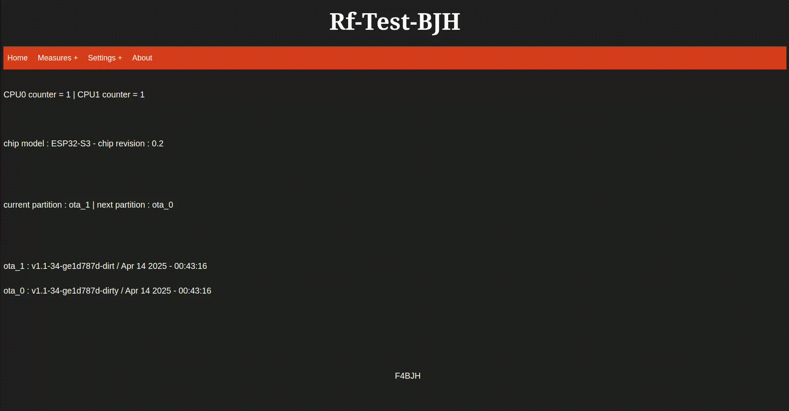
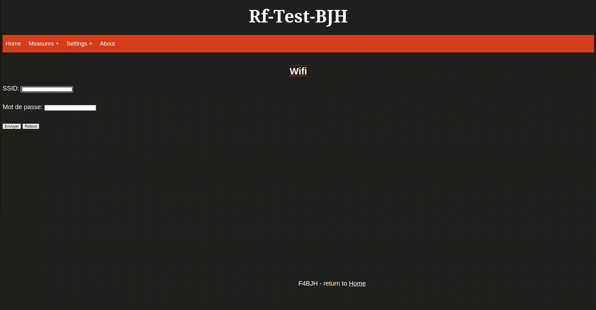
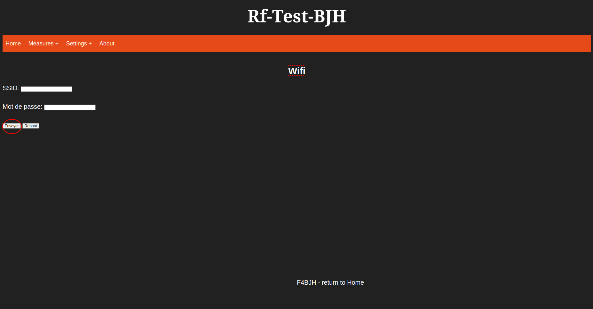
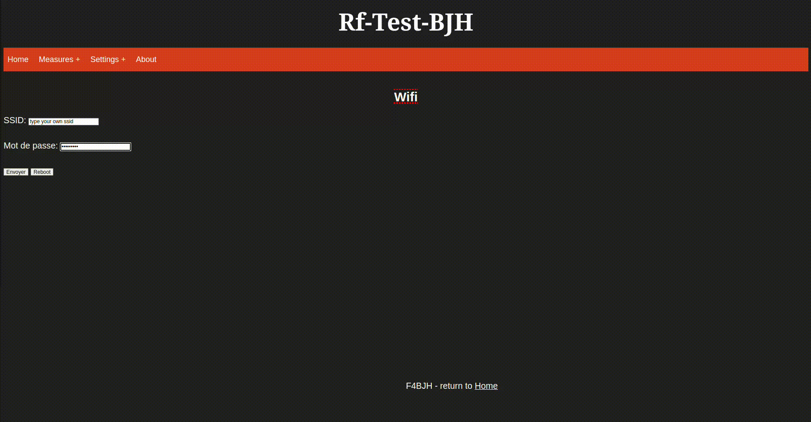
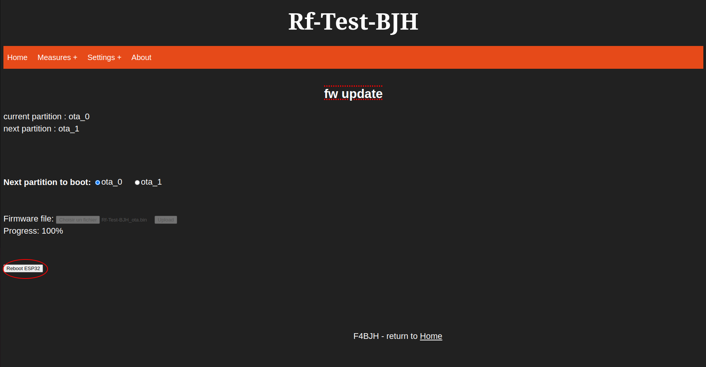

# How to setup Wifi of Rf-test-BJH

## Generals

Rf-test-BJH is able to handle 2 types of Wifi connections : _AP mode_ and _Station mode_.  
In _Ap mode_, Rf-Test-BJH can be seen as a full access point from any wifi client.  
In _Station mode_, Rf-Test-BJH can connect to any wifi access point.  

On factory firmware, only _Ap mode_ is provided.  
On ota firmware, both mode (_Ap mode_ and _Station mode_) are available.  

## How to setup _Ap mode_   
Scan your wifi network. By default, SSID and password of _Ap mode_ of Rf-Test-BJH are :   

```
ssid -> "Rf-Test-BJH AP"
password -> no password
```

Once you are connected to "Rf-Test-BJH AP" access point, open your favorite web navigator. Connect ot the IP address (192.168.x.y) displayed on the LCD.  


## How to setup _station mode_   
The very first time, you need to connect to Rf-Test-BJH in AP mode to setup wifi credentials (ssid and password)  

1. Go to the Wifi page  



2. Enter the ssid of the wifi network on wich you want Rf-Test-BJH to connect  
 


3. Click on "Envoyer"  




4. When server states that wifi credentials have been correctly set, click on OK  



5. Click on reboot 




