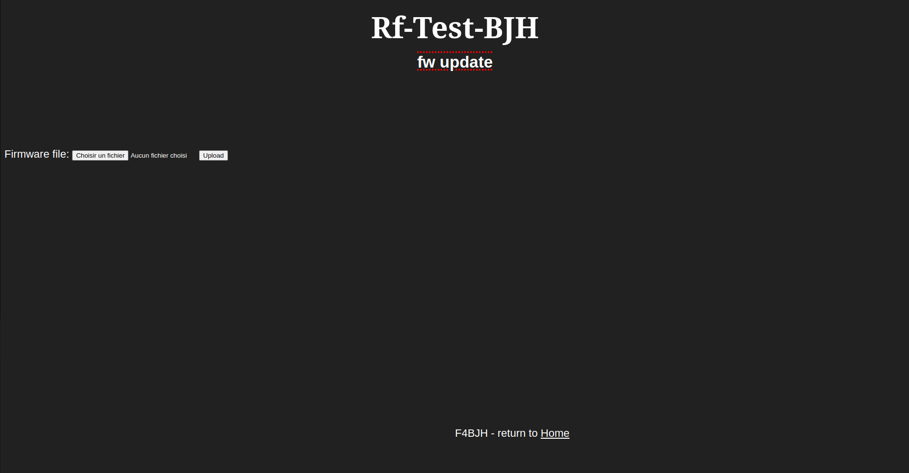
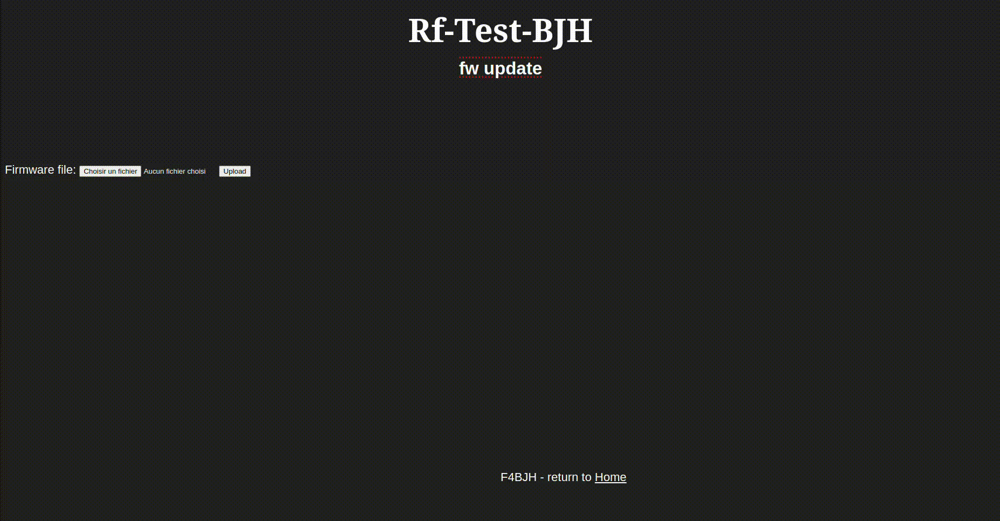
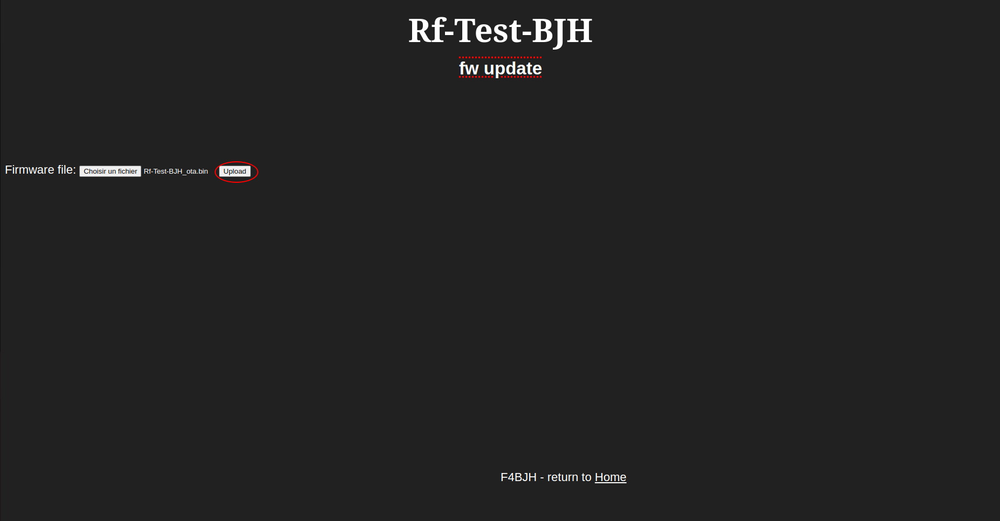
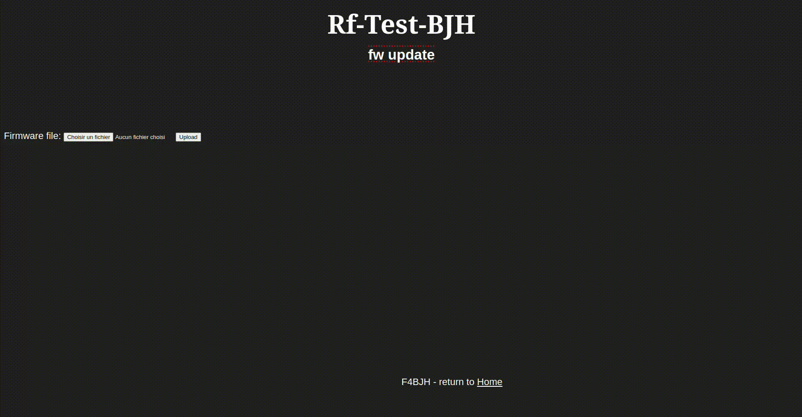
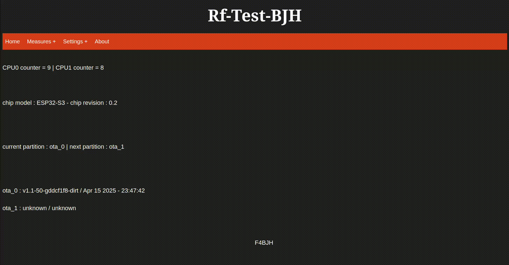
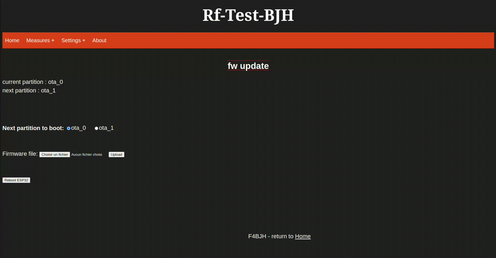
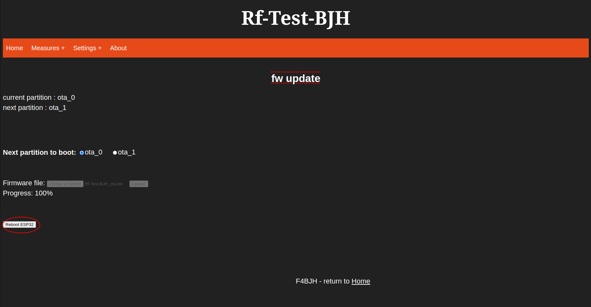
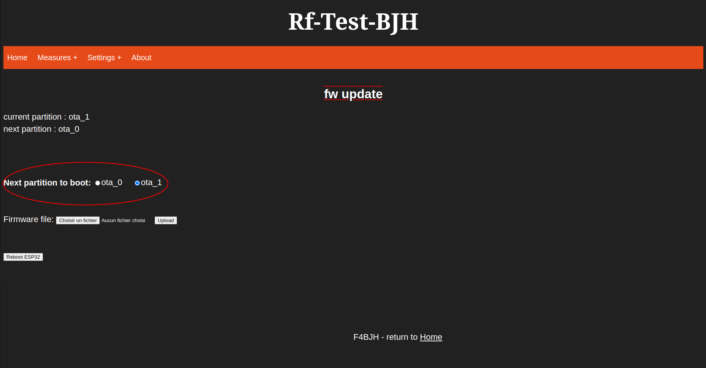

# How to update firmware of Rf-Test-BJH

## Generals

Rf-test-BJH has 2 operating mode : _factory mode_ and _ota mode_.   

In _factory mode_, Rf-Test-BJH has very limited functionnalities : 
  - Rf-Test-BJH is only accessible through _AP mode_ 
  - only uploading new firmware and switching to _ota mode_ are available.  

In _ota mode_, Rf-Test-BJH has full functionnalities : 
  - measures are operationnal
  - wifi setup
  - uploading new firmware
  - etc etc...  

In this mode, Rf-Test-BJH has two partitions defined in non-volatile memory (flash), allowing different firmware versions to be downloaded.  
After the download, the user can select the desired firmware version by choosing the corresponding boot partition.  

These 2 partitions are named **ota_0** and **ota_1**

## How to upload new firmware in _factory mode_  

1. Once Rf-Test-BJH has booted, open your favorite navigator, and enter the address displayed on LCD. You get following page :  

In _factory mode_ firmware are uploaded programmed in partition **ota_0** of the flash memory.  

2. Click on "Choisir un fichier" and choose firmware to upload from your local drive.

3. Click on "upload" and wait for progress reaches 100%

At this point, Rf-Test-BJH is rebooting.    
After reboot, Rf-Test-BJH operates now in _ota mode_ (from **ota_0** partition) and is still in _AP mode_.   

## How to upload new firmware in _ota mode_  

1. Got to upload page  

As you are in _ota mode_, this page display : 
  - the current running partition
  - the next partition on which Rf-Test-BJH will reboot (just after new firmware upload).

2. Click on "Choisir un fichier" and choose firmware to upload from your local drive.

3. Click on "upload" and wait for progress reaches 100%

4. Click on "Reboot ESP32" to reboot on next partition

## In _ota mode_, choose the next partition to boot

1. Got to upload page  

2. Choose next partition to boot

3. Click on "Reboot ESP32" to reboot on choosen partition
